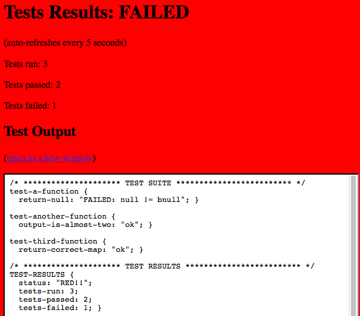
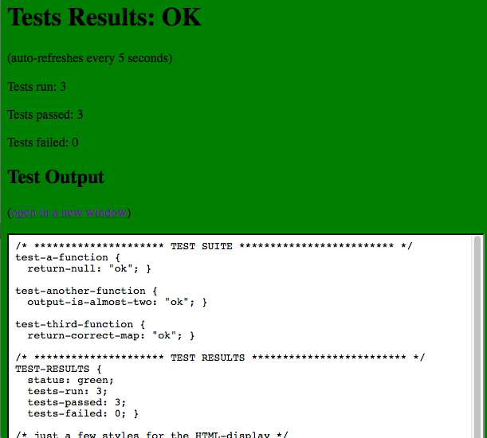

# Sassquatch

A small library for unit testing Sass (scss) functions, complete with a test-runner and at some visual output. 

As opposed to [Bootcamp](http://thejameskyle.com/bootcamp/) and [True](http://ericsuzanne.com/true/), the main focus of this library is to make writing tests as painless as possible, reducing the amount of necessary boilerplate code to a minimum. 


## Writing tests


Tests are created in a separate partial, because you want to separate test output from the CSS of your actual project.

You import the partial that contains the functions to test at the top and then add tests like in the example below. How you group those tests is entirely up to you, I prefer one block per function. YMMV.

Create `my-functions.scss`:

```scss
@function another-function() {
    @return 4;
}

@function third-function() {
    @return (foo: baz);
}
```

Then create `tests/my-functions-tests.scss`:

```scss
/* my-functions-tests.scss */
@import "../my-functions";

test-a-function {
  return-null: to-equal(a-function(), null);
}

test-another-function {
  output-is-almost-two: to-almost-equal(another-function(), 2, .5);
}

test-third-function {
	return-correct-map: to-equal(third-function(), (foo: bar));
}
```

When you add `tests/my-functions-tests.scss` to your test suite (see below for instructions), you will see the following output:

```css
/* ********************* TEST SUITE ************************* */
/* my-functions-tests.scss */
test-a-function {
  return-null: "FAILED: a-function() != null"; }

test-another-function {
  output-is-almost-two: "FAILED: 4 !~ 2"; }

test-third-function {
  return-correct-map: "FAILED: (foo: baz) != (foo: bar)"; }

/* ********************* TEST RESULTS ************************* */
TEST-RESULTS {
  status: "RED!!";
  tests-run: 3;
  tests-passed: 0;
  tests-failed: 3; }
```

The first test fails because the function _a-function()_ is not declared, you can see this because the function's name is present in the output, and not the actual return value of _a-function()_.

The second and third test fail because the functions output doesn't match the expectations. In the third test you can see that the matcher correctly processes (nested) maps, so you can test any sass data structure. 

Below the output of the individual tests you can see the overall status (red or green) and some numbers (tests run, failed and passed).

Let's fix the code:

```scss
@function a-function() {
	@return null;
}

@function another-function() {
	@return 1;
}

@function third-function() {
	@return (foo: bar);
}
```

Everything is fine now:

```css
/* ********************* TEST SUITE ************************* */
/* my-functions-tests.scss */
test-a-function {
  return-null: "ok"; }

test-another-function {
  output-is-almost-two: "ok"; }

test-third-function {
  return-correct-map: "ok"; }

/* ********************* TEST RESULTS ************************* */
TEST-RESULTS {
  status: green;
  tests-run: 3;
  tests-passed: 3;
  tests-failed: 0; }
```

## Create your test suite

Simply import your tests scripts in `test-runner.scss`:
@import "example/test/to-em-test";

```scss
@import "example/test/to-em-test";
```

Of course you can create partials that contain certain parts of your suite, and use all of scss' power to tweak your test suite on demand:

```scss
@if $full-regression {
    @import "very-slow-tests";
}
```

## TDD with Sass

First set up [Koala](http://koala-app.com/) (or something similar) to watch and recompile `test-runner.scss` on changes. 

When you then open `test-results.html` in a browser and s you'll see realtime[^ well, almost, the page refreshes every 5 seconds] results of your tests in the browser (status, number of tests run, passed and failed) complete with a nice red or green background. 





Included with the project is `config.rb` for Koala that compiles test-runner.css to the correct location to be picked up by `test-results.html`.

There's a link in the HTML-page to the css that is output by the test runner, so you can quickly check which tests have failed. 

At least on Firefox (OS-X) compiler errors are visible at the top of the webpage, so you don't miss them.

So you see, it's actually really easy to implement the red-green-refactor loop of TDD with scss functions.

## More examples

Take a look at `test-runner.scss` to see how to build a test-suite.

Examples for tests can be found in `example/test/to-em-tests.scss`.

## The future

I think this library would benefit from more matchers, but since I've only been using Sass only for 3 days, I haven't found the need to implement more. 

Testing mixins would be nice, but AFAIK that's not possible with Sass at the moment, I have found no way for introspetion or accessing the CSS output. After all it's just a preprocessor, not a programming language.


